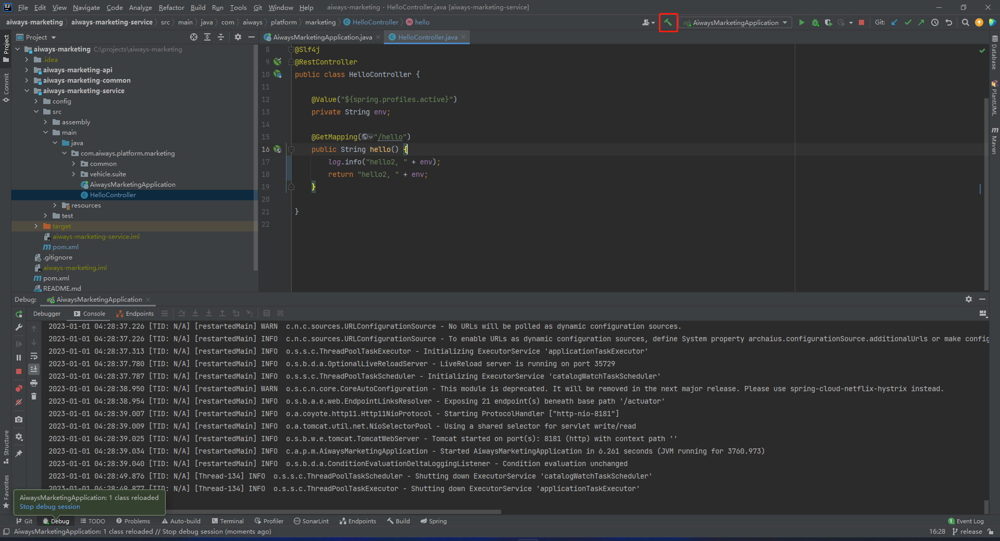
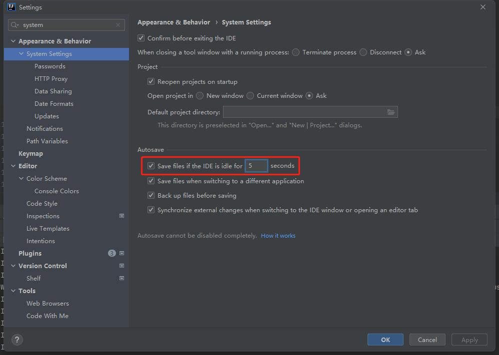
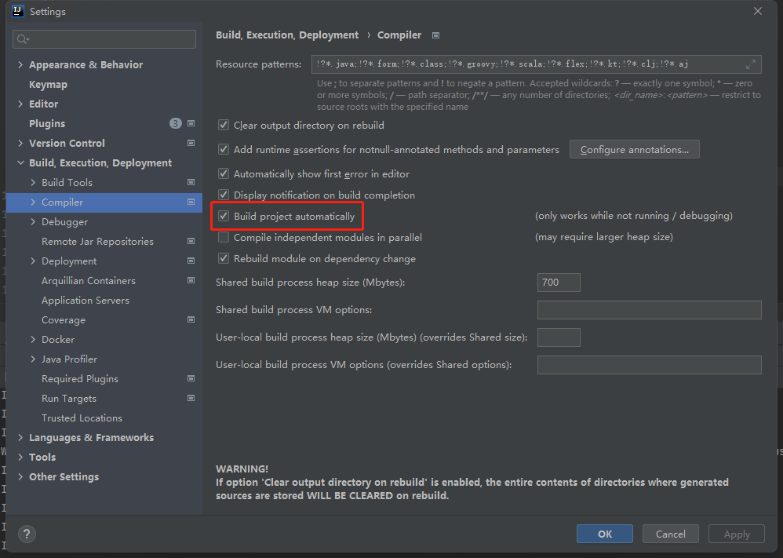
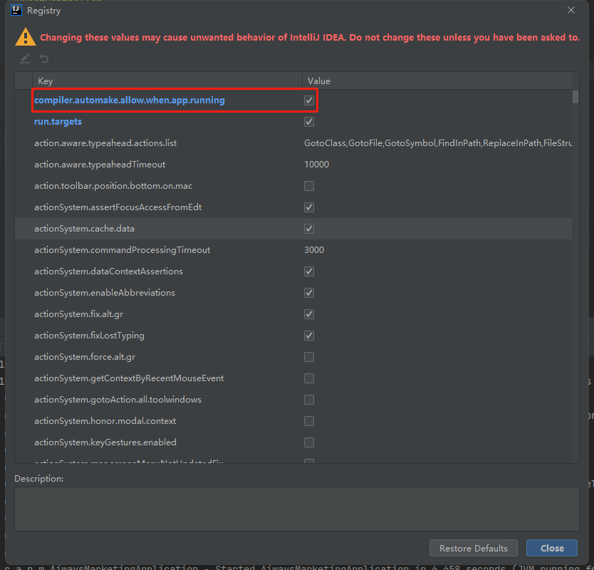

# Spring Boot 热部署

- [Spring Boot 热部署](#spring-boot-热部署)
  - [添加Maven依赖](#添加maven依赖)
  - [手动触发](#手动触发)
  - [自动触发](#自动触发)
    - [自动 Build](#自动-build)
    - [自动 Make](#自动-make)
  - [关闭热部署](#关闭热部署)

> 环境：
>
> - Spring Boot版本：2.x
> - 开发工具：IDEA

## 添加Maven依赖

```xml
<dependency>
    <groupId>org.springframework.boot</groupId>
    <artifactId>spring-boot-devtools</artifactId>
    <optional>true</optional>
</dependency>
```

## 手动触发

快捷键：Ctrl + F9


## 自动触发

通过设置IDEA，可以自动触发热部署

### 自动 Build

快捷键：`Ctrl + Alt + S`



### 自动 Make

快捷键：`Shift + Ctrl + Alt + /`，选择`1 Registry...`


## 关闭热部署

生产环境，通过增加以下配置，可以关闭热部署

```yml
spring:
  devtools:
    restart:
      enabled: false
```
